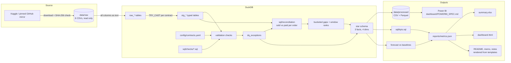

<!-- GENERATED FILE. Edit docs/templates/README.md.tmpl, then run python run_pipeline.py. Numbers come from reports/metrics.json. -->
# Olist Reconciliation, Data Quality & KPI Pipeline


Two systems record the same orders. The order system says what was **sold**. The payment system says what was **paid**. They disagree, and nobody trusts the numbers. This project finds every disagreement, explains it with evidence, and ships the result as tables, an Excel report, a dashboard and a Power BI model.

Built on the real [Brazilian E-Commerce Public Dataset by Olist](https://www.kaggle.com/datasets/olistbr/brazilian-ecommerce): 99,441 orders placed 2016-09-04 to 2018-10-17. All money is in **Brazilian real (BRL, R$)**.

**Skills shown:** SQL (CTEs, joins, window functions) · Python/pandas · DuckDB · schema contracts and data validation · two-system reconciliation · exception handling · KPI design · forecasting against a baseline · Excel reporting · star schema for Power BI · pytest failure-injection tests · GitHub Actions CI · writing for managers.

## Results at a glance

| What | Result |
|---|---:|
| Orders reconciled | 99,441 |
| Match rate (paid = sold within R$ 0.01) | 98.91% |
| Match rate, orders present in both systems | 99.69% |
| Unmatched orders | 1,079 |
| Total absolute gap | R$ 166,004.63 (1.037% of R$ 16,008,872.12 paid) |
| Paid on orders that have no items | R$ 162,591.95 on 775 orders |
| Value mismatches explained by evidence | 298 of 303 (98.35%) |
| Orders left unexplained | 5 (R$ 77.54) |
| Data quality checks | 81 checks, 2,483 exceptions, 99.58% of rows clean |
| On-time delivery | 93.23% |
| Avg review, matched vs unmatched orders | 4.11 vs 2.33 stars |
| Forecast | `naive_last_value` wins with 8.74% holdout MAPE |

Open `reports/dashboard.html` in a browser for the interactive version, or `reports/summary.xlsx` for the manager version. The one-page summary for non-technical readers is [`reports/FINDINGS_MEMO.md`](reports/FINDINGS_MEMO.md).

## The business problem

Finance closes the month from payments. Operations and category managers report from order items. When the two totals differ, every meeting starts with "whose number is right?" instead of "what do we do?".

The questions this project answers:
1. For each order, does what the customer paid equal what was sold (item price + freight)?
2. When it does not, **why**? Which gaps are normal (card interest, rounding) and which need action (money taken with no goods recorded)?
3. Can we trust the underlying data at all? Which records break the rules, and how badly?
4. What do the KPIs look like once the data is trusted, and what order volume should we plan for?

## Architecture



## How to run

```bash
pip install -r requirements.txt
python run_pipeline.py          # downloads data if missing, then runs every step
python -m pytest                # failure-injection and end-to-end tests on a small fixture, no download needed
```

Options: `--raw-dir PATH` to use your own copy of the CSVs, `--no-download` to skip the download step, `--out-dir PATH` to write outputs somewhere else.

The raw data is not committed. `src/download.py` tries Kaggle first (needs credentials), then a GitHub mirror pinned to one commit, and refuses to run unless every file matches its SHA-256 checksum. Details: [`data/SOURCE.md`](data/SOURCE.md).

## Repository map

| Path | What it is |
|---|---|
| `run_pipeline.py` | single entry point |
| `config/contracts.yaml` | schema contract per table: types, required columns, keys, allowed values, foreign keys |
| `sql/checks/generic/` | SQL templates filled from the contract (duplicates, nulls, types, allowed values, orphans) |
| `sql/checks/*.sql` | business-rule checks (date order, amounts, payment sequence, orphan reviews) |
| `sql/reconciliation/` | the reconciliation: totals, buckets, window-function rankings, evidence queries |
| `sql/star/star_schema.sql` | facts and dimensions for BI |
| `sql/kpis.sql` | every KPI as a named SQL query |
| `src/` | Python that runs the SQL, the forecast, the reports and the doc rendering |
| `tests/` | failure-injection, completeness, reconciliation and end-to-end tests |
| `data/processed/` | star schema as CSV and Parquet |
| `reports/` | metrics.json, summary.xlsx, dashboard.html, evidence CSVs, findings memo |
| `dashboard/POWERBI_SPEC.md` | page-by-page Power BI build with DAX |
| `docs/DATA_DICTIONARY.md` | every output table and column |
| `NOTES.md` | learning guide and interview prep |

## Data quality rules

Contract rules come from `config/contracts.yaml`; business rules are plain SQL in `sql/checks/`. **No row is ever deleted.** Each failing row goes to `dq_exceptions` with the table, row id, key, check, reason and severity. Rows with a high or medium exception are *quarantined* (kept, but left out of the `clean_*` views).

| Check | What it catches | Severity | Rows flagged |
|---|---|---|---:|
| `duplicate_key` | same primary key twice (every copy after the first) | high (medium for review ids) | 814 |
| `required_null` | a required column is empty | high | 0 |
| `type_mismatch` | value cannot be cast to the contract type (e.g. `abc` as a price) | high | 0 |
| `allowed_values` | status, payment type, state or score outside the allowed list | medium | 3 |
| `orphan_foreign_key` | item or payment for an unknown order, unknown product/seller/category | high (medium for lookups) | 13 |
| `approved_before_purchase` | approval timestamp before purchase | high | 0 |
| `carrier_before_purchase` | handed to carrier before purchase | high | 166 |
| `delivered_before_purchase` | delivered before purchase | high | 0 |
| `delivered_before_carrier` | delivered to customer before carrier pickup | medium | 23 |
| `carrier_before_approval` | shipped before payment approval was recorded | low | 1,359 |
| `delivered_without_date` | status delivered, no delivery date | medium | 8 |
| `delivery_date_on_undelivered_order` | delivery date on a canceled/shipped order | medium | 6 |
| `non_positive_price` / `negative_freight` | price <= 0 or freight < 0 | high | 0 / 0 |
| `negative_payment` / `zero_value_payment` | payment below zero / exactly zero | high / low | 0 / 9 |
| `invalid_installments` | fewer than 1 installment | medium | 2 |
| `payment_sequence_gap` | payment_sequential skips a number | low | 80 |
| `review_unknown_order` | review for an order that does not exist | high | 0 |
| `review_answered_before_created` | review answered before it was created | medium | 0 |

Rows by status after validation:

| Table | Rows in | Clean | Warning (low only) | Quarantined |
|---|---:|---:|---:|---:|
| `order_items` | 112,650 | 112,650 | 0 | 0 |
| `order_payments` | 103,886 | 103,797 | 84 | 5 |
| `customers` | 99,441 | 99,441 | 0 | 0 |
| `orders` | 99,441 | 98,045 | 1,193 | 203 |
| `order_reviews` | 99,224 | 98,410 | 0 | 814 |
| `products` | 32,951 | 32,938 | 0 | 13 |
| `sellers` | 3,095 | 3,095 | 0 | 0 |
| `category_translation` | 71 | 71 | 0 | 0 |

Completeness is enforced by tests: for every table, rows in = usable + quarantined, and rows in = rows with no exception + rows with at least one.

## Reconciliation logic

For every `order_id` seen in **any** of orders, order items or payments:

- **Sold (system A)** = sum of `price + freight_value` over the order's items
- **Paid (system B)** = sum of `payment_value` over the order's payments
- **Gap** = paid - sold, **absolute gap** = |gap|, **gap %** = gap / sold
- **Matched** if |gap| <= R$ 0.01

Amounts are cast to `DECIMAL(12,2)`, not float, so cents add up exactly.

**Mismatches were investigated before any bucket was defined.** The buckets below each rest on a pattern found in the data, saved as a CSV in `reports/evidence/`. Rules run top to bottom and the first match wins, so every order lands in exactly one bucket.

| Bucket | Rule | Evidence | Orders | Absolute gap |
|---|---|---|---:|---:|
| rounding | 2+ items and \|gap\| <= 1 cent x item count | every gap between 2 and 10 cents is on a multi-item order (`rounding_by_item_count.csv`) | 44 | R$ 1.00 |
| voucher_related | a voucher is one of the payments | all are card + voucher splits that overshoot the total (`voucher_orders.csv`) | 7 | R$ 17.48 |
| installment_interest | paid > sold, credit card only, 2+ installments | median overpayment climbs from 3.46% at 2 installments to 15.50% at 12; 69.83% of these orders share one of 20 exact paid/sold ratios: a rate table (`interest_rate_card.csv`) | 232 | R$ 3,050.01 |
| untracked_discount | paid < sold by exactly 5% or 10% of product price | shortfalls land on 5.00% or 10.00% of price; debit card mostly 5%, credit card 10% (`discount_share_of_price.csv`) | 15 | R$ 123.19 |
| missing_items | payment exists, no items | 98.97% are canceled or unavailable orders (`missing_items_by_status.csv`) | 775 | R$ 162,591.95 |
| missing_payment | items exist, no payment | direct | 1 | R$ 143.46 |
| orphan_no_order | items/payments for an order_id not in orders | direct | 0 | R$ 0.00 |
| unexplained | none of the above | these need a person | 5 | R$ 77.54 |

Also checked and ruled out: 80 orders have holes in `payment_sequential`, which looked like missing payment rows, but 79 of them still reconcile to the cent. So a sequence gap is logged as low severity, not treated as missing money.

Window functions (`sql/reconciliation/03_gap_rankings.sql`): `DENSE_RANK()` ranks the biggest gap per purchase month and per state, a running `SUM() OVER` gives each order's cumulative share of all unmatched money, and `LAG()` gives the month-over-month change in unmatched orders. Result: **344 orders (31.9% of unmatched) hold 80% of the unmatched money.**

## Results

Gap by bucket:

| Bucket | Severity | Orders | Absolute gap (R$) | Net gap (R$) | Share of gap |
|---|---|---:|---:|---:|---:|
| `missing_items` | high/medium | 775 | 162,591.95 | 162,591.95 | 97.94% |
| `installment_interest` | low | 232 | 3,050.01 | 3,050.01 | 1.84% |
| `missing_payment` | high | 1 | 143.46 | -143.46 | 0.09% |
| `untracked_discount` | medium | 15 | 123.19 | -123.19 | 0.07% |
| `unexplained` | high | 5 | 77.54 | -73.22 | 0.05% |
| `voucher_related` | medium | 7 | 17.48 | 17.48 | 0.01% |
| `rounding` | low | 44 | 1.00 | -0.02 | 0.00% |

Exceptions by severity (data quality + reconciliation):

| Severity | Total | Data quality | Reconciliation |
|---|---:|---:|---:|
| high | 180 | 166 | 14 |
| medium | 1,658 | 869 | 789 |
| low | 1,724 | 1,448 | 276 |

Top customer states by unmatched orders:

| State | Name | Orders | Unmatched | Unmatched rate | Absolute gap (R$) |
|---|---|---:|---:|---:|---:|
| SP | São Paulo | 41,746 | 489 | 1.17% | 76,991.14 |
| MG | Minas Gerais | 11,635 | 127 | 1.09% | 16,113.91 |
| RJ | Rio de Janeiro | 12,852 | 126 | 0.98% | 14,837.38 |
| PR | Paraná | 5,045 | 63 | 1.25% | 10,278.42 |
| RS | Rio Grande do Sul | 5,466 | 52 | 0.95% | 5,071.92 |
| SC | Santa Catarina | 3,637 | 39 | 1.07% | 12,872.83 |
| BA | Bahia | 3,380 | 37 | 1.09% | 5,139.19 |
| GO | Goiás | 2,020 | 21 | 1.04% | 2,385.43 |
| DF | Distrito Federal | 2,140 | 19 | 0.89% | 1,931.64 |
| ES | Espírito Santo | 2,033 | 15 | 0.74% | 1,165.70 |

Top product categories by unmatched orders (orders with items only):

| Category | Orders | Unmatched | Unmatched rate | Absolute gap (R$) |
|---|---:|---:|---:|---:|
| bed_bath_table | 9,328 | 40 | 0.43% | 523.42 |
| furniture_decor | 6,330 | 25 | 0.39% | 306.70 |
| computers_accessories | 6,670 | 21 | 0.31% | 122.89 |
| telephony | 4,179 | 21 | 0.50% | 114.63 |
| housewares | 5,821 | 18 | 0.31% | 88.52 |
| health_beauty | 8,801 | 17 | 0.19% | 409.49 |
| sports_leisure | 7,683 | 17 | 0.22% | 100.72 |
| cool_stuff | 3,603 | 14 | 0.39% | 177.63 |
| toys | 3,870 | 11 | 0.28% | 130.93 |
| baby | 2,837 | 11 | 0.39% | 51.60 |

Customer impact:

| | Orders | Avg review (1-5) | Share of 1-2 star reviews |
|---|---:|---:|---:|
| Matched orders | 98,362 | 4.11 | 14.13% |
| Unmatched orders | 1,079 | 2.33 | 61.87% |

Delivered orders: 96,476; on time 93.23%, late 6.77%. Late orders average 2.27 stars against 4.29 for on-time orders.

## Forecast vs baseline

Monthly order volume, 3 months ahead. Months at the edges of the data are near-empty (collection start and cut-off), so the model uses the longest run of complete months: 2017-01 to 2018-08. The last 3 of those (2018-06 to 2018-08) are the holdout.

| Model | Type | Holdout MAPE |
|---|---|---:|
| `naive_last_value` | baseline | 8.74% |
| `seasonal_naive_12m` | baseline | 38.96% |
| `moving_average_3m` | model | 10.87% |
| `holt_damped_trend` | model | 28.85% |

**Honest result: a naive baseline wins. naive_last_value beats every model on the holdout, so the baseline is the forecast. A model that loses to 'same as last month' is not worth shipping.**

Winner: `naive_last_value` at 8.74% MAPE. Best non-baseline model: `moving_average_3m` at 10.87% (2.13 points vs the best baseline; positive = worse). Why the trend model struggles here: Holt's method extends the 2017 ramp-up, while monthly volume in the holdout had flattened (see the holdout table in `reports/summary.xlsx`, sheet Forecast). Seasonal naive copies the same month of 2017, a ramp-up year, so it undershoots.

Forecast used: 6,512, 6,512 and 6,512 orders for 2018-09, 2018-10 and 2018-11.

Caveat: November 2017 was 62.9% above October 2017 (Black Friday). With one year of history no model can learn that spike reliably, so the November figure should be planned with a manual Black Friday uplift.

## Limitations

- **One side of history.** We see the order and payment tables, not bank settlements or refunds. "Missing items" orders may have been refunded; this data cannot prove it.
- **Evidence, not ground truth.** Buckets are inferred from patterns (exact interest multipliers, exact 5%/10% shortfalls). They are strong patterns but not confirmed by Olist's finance team.
- **Rate table is inferred.** 69.83% of interest orders sit on a shared multiplier; the rest are consistent with interest but not on a repeated ratio.
- **Forecast history is short.** 17 training months, one Black Friday, no promotions calendar.
- **Anonymised data.** Customer and seller ids are hashed; review text had company names replaced.
- **Snapshot.** The dataset ends 2018-10-17; the final months are near-empty and are excluded from trends and the forecast.

## Next steps

1. Pull refund records and close out the 775 paid-no-items orders.
2. Book card interest as its own revenue line so sold and paid tie out by design.
3. Write discounts into the order system at checkout, not only at payment.
4. Run the pipeline daily; alert when the match rate drops or high-severity exceptions appear.
5. Add a promotions calendar and a second year of data before trying anything fancier than the baseline.

## Dataset, license and attribution

Data: **Brazilian E-Commerce Public Dataset by Olist**, https://www.kaggle.com/datasets/olistbr/brazilian-ecommerce. Provided by Olist. Licensed **CC BY-NC-SA 4.0** (Attribution, NonCommercial, ShareAlike). Derived tables in `data/processed/` and the fixtures in `tests/fixtures/` are shared under the same license. Download source, date and checksums: [`data/SOURCE.md`](data/SOURCE.md).

*Metrics generated 2026-09-29T07:24:44+00:00.*
